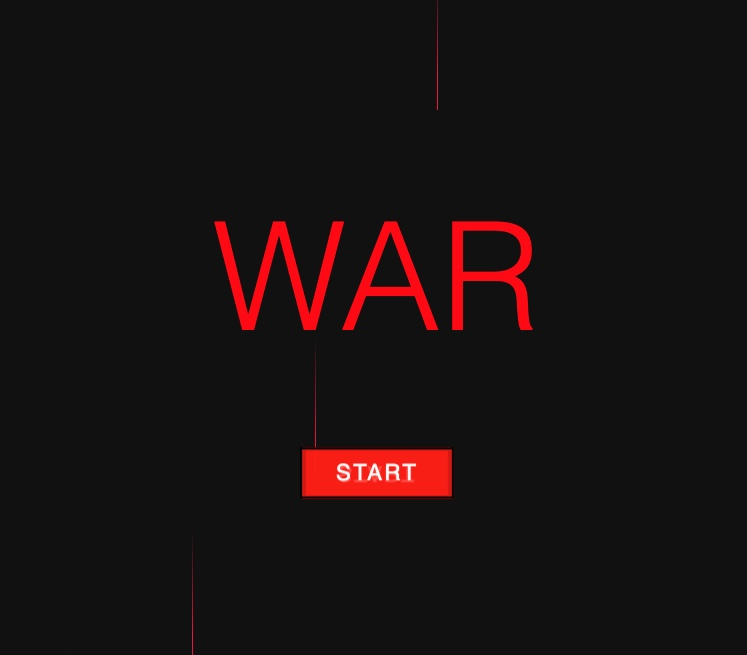

# 🎮 Game Description

**WAR** is a digital version of the classic card game “War,” built with JavaScript, HTML, and CSS.

In War, two players (you vs. computer) split a deck of cards in half. The two players each get one half of the deck to draw from. The players then draw cards from the top of the deck. The player with the higher card wins the round and collects both cards. If there’s a tie, a "tie" is triggered where each player loses both cards drawn. The game continues until one player runs out of cards.

I chose this project because “War” is a game i used to play a lot with my grandparents and brother growing up. So it hold special meaning to me.

##  Getting Started

Deployed Game: [WAR](https://jpangi.github.io/project-1/startScreen.html)

Planning Materials: [Link to planning materials] (insert your Google Doc, Trello board, or notes link here)

### How to Play

1. Press the Start button to begin.

2. Click Shuffle Deck to start the game.

3. Click Draw to play a round.

4. The higher card wins both cards.

5. If there’s a tie, a "tie" function destroys both cards.

6. The game ends when one player has all the cards.

7. Click the Reset to start another game

##  Attributions
[Prismic](https://prismic.io/blog/css-background-effects) - Animated Backgrounds for start screen

MDN Web Docs
 – Reference for JavaScript, HTML, and CSS.

[CSS flexbox](https://css-tricks.com/snippets/css/a-guide-to-flexbox/)
 – Styling tips and layout resources.

##  Technologies Used

**JavaScript** – Game logic and DOM manipulation

**HTML** – Structure and layout

**CSS** – Styling and UI design

##  Next Steps (Stretch Goals)

Add sound effects and animations.

Add a draw 4 cards and compare function

Add multiplayer (two-player mode).

Improve mobile responsiveness and accessibility.